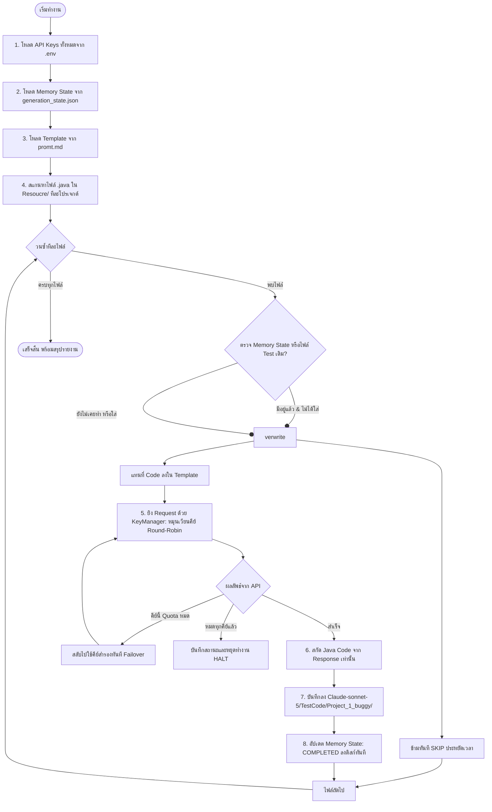

# คู่มือการใช้งาน Script สร้าง JUnit Test ด้วย Claude Sonnet 5 (KKU GenAI)

สคริปต์นี้ถูกออกแบบมาเพื่อนำ Source Code ที่มี Bug จากโฟลเดอร์ **`Resoucre/`** ส่ง Request ไปยัง KKU GenAI API (`https://gen.ai.kku.ac.th/api/v1/chat/completions`) โดยใช้โมเดล **`claude-sonnet-5`** และ Template ใน `Claude-sonnet-5/Promt/promt.md` เพื่อสร้าง JUnit Test Suite อัตโนมัติทีละไฟล์ ทีละโปรเจกต์ แล้วนำโค้ดที่ได้รับจาก Response มาจัดเก็บลงใน **`Claude-sonnet-5/TestCode/<Project>_1_buggy/`**

---

## 📌 สารบัญ
1. [ภาพรวมการทำงานและระบบ Memory State](#1-ภาพรวมการทำงานและระบบ-memory-state)
2. [ระบบรองรับหลาย API Key (Multi-Key Rotation & Failover)](#2-ระบบรองรับหลาย-api-key-multi-key-rotation--failover)
3. [ระบบจัดการ Token / Quota หมด และการรันต่อ (Resume)](#3-ระบบจัดการ-token--quota-หมด-และการรันต่อ-resume)
4. [การตั้งค่า API Key ใน .env](#4-การตั้งค่า-api-key-ใน-env)
5. [วิธีรันคำสั่ง (Usage Examples)](#5-วิธีรันคำสั่ง-usage-examples)
6. [พารามิเตอร์ทั้งหมด (CLI Arguments)](#6-พารามิเตอร์ทั้งหมด-cli-arguments)
7. [ข้อควรระวังและระบบความปลอดภัยของโค้ด](#7-ข้อควรระวังและระบบความปลอดภัยของโค้ด)
8. [งบ Token และการประเมินเวลา](#9-งบ-token-และการประเมินเวลา)

---

## 1. ภาพรวมการทำงานและระบบ Memory State

สคริปต์มีระบบ **Memory State Tracking** ในไฟล์ `Claude-sonnet-5/generation_state.json` ซึ่งจะบันทึกสถานะของแต่ละไฟล์ (COMPLETED / FAILED / tokens / เวลาที่รัน) ทันทีหลังประมวลผลเสร็จในแต่ละไฟล์ หากโปรแกรมหยุดกลางคัน หรือ Token หมด เมื่อสั่งรันใหม่จะข้ามไฟล์ที่สำเร็จแล้วทันที ไม่เสียเวลาและไม่เสีย Token ซ้ำซ้อน



---

## 2. ระบบรองรับหลาย API Key (Multi-Key Rotation & Failover)

สคริปต์รองรับการใส่หลาย API Key พร้อมกันเพื่อกระจายโหลดและป้องกันปัญหางานสะดุด:

1. **Round-Robin Load Balancing**:
   - สลับใช้งานคีย์ถัดไปอัตโนมัติในแต่ละ Request (เช่น Request 1 ใช้ Key 1, Request 2 ใช้ Key 2, Request 3 ใช้ Key 1 ...)
   - ช่วยลดความเสี่ยงจากการติด Rate Limit ของแต่ละคีย์

2. **Auto-Failover เมื่อคีย์ใดคีย์หนึ่งโควต้าหมด**:
   - หากคีย์ปัจจุบันเจอโควต้ารายวันหมด สคริปต์จะ **ตัดคีย์นั้นออกจากคิวในรอบนี้**; rate limit ชั่วคราวไม่ถือว่าโควต้าหมด
   - สลับไปใช้คีย์สำรองถัดไปเพื่อยิง Request นั้นต่อทันทีโดยไม่ต้องเริ่มใหม่
   - จะหยุดทำงานเฉพาะเมื่อ **ทุกคีย์ที่มีในระบบหมดโควต้าแล้วจริงๆ เท่านั้น**

---

## 3. ระบบจัดการ Token / Quota หมด และการรันต่อ (Resume)

### 🛑 กรณี Token / Quota หมดทุกคีย์:
1. สคริปต์ตรวจข้อความ Error ที่ระบุว่าโควต้าหมด เช่น `insufficient_quota`, `exceeded your current quota` และ `daily limit`; HTTP 429 เพียงอย่างเดียวอาจเป็น rate limit ชั่วคราว
2. หากคีย์ทั้งหมดหมดโควต้า สคริปต์จะ **หยุดการทำงานทันที (HALT)** และบันทึกสถานะไฟล์ล่าสุดไว้ใน `Claude-sonnet-5/generation_state.json`

### 🔄 การรันต่อหลังจากเติม Token หรือเปลี่ยนคีย์:
- เพียงรันคำสั่งเดิม:
  ```bash
  python script/generate_claude_tests.py
  ```
- สคริปต์จะอ่าน Memory State และ **ข้าม (SKIP) ทุกไฟล์ที่ทำเสร็จไปแล้วโดยอัตโนมัติ** และจะเริ่มทำงานต่อที่ไฟล์ที่ค้างอยู่ทันที

### ⌨️ กรณีผู้ใช้กดหยุดเอง (Ctrl+C):
- สคริปต์มี Handler ดักจับ `KeyboardInterrupt` เพื่อบันทึกสถานะล่าสุดลงดิสก์ก่อนปิดโปรแกรมเสมอ ข้อมูลไม่สูญหายแน่นอน

---

## 4. การตั้งค่า API Key ใน .env

สคริปต์รองรับรูปแบบการใส่คีย์ในไฟล์ `.env` ได้หลายแบบ:

### แบบที่ 1: แยกรายบรรทัด (แนะนำ)
```env
API_KEY=sk_E3pJjTWdbtdZ7TPB2IGkonjaYFbkhvnjYNIRUardUM0uRVelBBkZ7RNKL4wHDrbt
API_KEY2=sk_nWIdRGlat6gkYVqUWjM5fEYfE4I4mP6wN10ITjNt6bniGmph14qw3aMj1b7X6ADW
API_KEY3=sk_อีกคีย์หนึ่ง...
```

### แบบที่ 2: คั่นด้วยจุลภาค (Comma-separated)
```env
API_KEYS=sk_key1...,sk_key2...,sk_key3...
```

---

## 5. วิธีรันคำสั่ง (Usage Examples)

### 5.1 ตรวจสอบสถานะความคืบหน้าและสถานะคีย์ API (`--status`)
ดูว่ามีคีย์ไหนใช้งานได้บ้าง ไฟล์ไหนเสร็จแล้ว ไฟล์ไหนค้างอยู่ โดยไม่ยิง API:
```bash
python script/generate_claude_tests.py --status
```

### 5.2 ทดสอบก่อนรันจริง (Dry-Run Mode)
แสดงรายการไฟล์ที่จะถูกประมวลผลทั้งหมดโดยยังไม่ยิง API:
```bash
python script/generate_claude_tests.py --dry-run
```

### 5.3 รันต่อเนื่องจากจุดเดิม (Resume / Run All)
```bash
python script/generate_claude_tests.py
```

### 5.4 รันเฉพาะโปรเจกต์ที่ต้องการ (เช่น Codec_1 หรือ Chart_1)
```bash
python script/generate_claude_tests.py --project Codec_1
```

### 5.5 ระบุ API Keys ผ่าน Command line โดยตรง
```bash
python script/generate_claude_tests.py -k "sk_key1..." -k "sk_key2..."
```

### 5.6 บังคับสร้างใหม่ทั้งหมด (`--overwrite`)
ละเว้น Memory State และบังคับยิงสร้างใหม่ทุกไฟล์:
```bash
python script/generate_claude_tests.py --overwrite
```

### 5.7 ล้าง Memory State เพื่อเริ่มต้นนับหนึ่งใหม่ (`--reset-state`)
```bash
python script/generate_claude_tests.py --reset-state
```

### 5.8 ดูโค้ดที่โมเดลกำลังเขียนแบบสตรีมสดลงหน้าจอ (`-v` หรือ `--show-stream`)
```bash
python script/generate_claude_tests.py --project Codec_1 -v
```

### 5.9 รันตาม Greedy Batch Strategy แบ่งตาม Phase (`--phase`)
```bash
# รันเฉพาะ Phase 1 (ไฟล์เล็ก/กลาง)
python script/generate_claude_tests.py --phase 1

# รันเฉพาะ Phase 2 (ไฟล์ขนาดใหญ่)
python script/generate_claude_tests.py --phase 2
```

---

## 6. พารามิเตอร์ทั้งหมด (CLI Arguments)

| Argument | ชนิด | ค่าเริ่มต้น | คำอธิบาย |
| :--- | :--- | :--- | :--- |
| `--phase` | string | `all` | `1` ไฟล์เล็ก/กลาง, `2` ไฟล์ใหญ่, `all` ทุกไฟล์เรียงเล็กไปใหญ่ |
| `--max-tokens` | int | `None` | กำหนด max_tokens คงที่สำหรับทุกไฟล์ (ค่าเริ่มต้น: 8192 ซึ่งเป็นเพดานสูงสุดเต็มพิกัดของ Claude Sonnet 5) |
| `--skip-limits` | flag | `False` | ข้ามไฟล์ที่เคยติดสถานะ LIMIT_REACHED (โดยค่าเริ่มต้น สคริปต์จะทำการ Auto-retry ไฟล์ที่ชนลิมิตให้อัตโนมัติด้วยเพดาน 8,192 tokens) |
| `--retry-limits` | flag | `True` | รันซ่อมไฟล์ที่เคยติดสถานะ LIMIT_REACHED (เปิดใช้งานเป็นค่าเริ่มต้นเสมอ) |
| `--status` | flag | `False` | แสดงรายงานความคืบหน้าปัจจุบัน (Completed/Limit Reached/Pending/Failed) และสถานะคีย์ทั้งหมด |
| `--reset-state` | flag | `False` | ล้างประวัติ Memory State เริ่มต้นใหม่ |
| `--state-file` | string | `Claude-sonnet-5/generation_state.json` | กำหนดตำแหน่งไฟล์บันทึกสถานะ Memory |
| `--project`, `-p` | string | `None` | ระบุชื่อโปรเจกต์ เช่น `Codec_1`, `Chart_1` (ไม่ระบุ = ทุกโปรเจกต์) |
| `--file`, `-f` | string | `None` | ระบุชื่อไฟล์เฉพาะ เช่น `Caverphone.java` |
| `--api-key`, `-k` | string (list) | `[]` | API Key (สามารถระบุซ้ำได้หลายครั้ง `-k key1 -k key2`) |
| `--env-file` | string | `None` | ระบุพาธไฟล์ `.env` เอง |
| `--overwrite` | flag | `False` | บังคับเขียนทับและสร้างใหม่ แม้เคยทำเสร็จแล้วใน Memory หรือมีไฟล์บนดิสก์ |
| `--delay` | float | `2.0` | หน่วงเวลาระหว่าง Request แต่ละครั้ง (วินาที) ป้องกัน Rate Limit |
| `--dry-run` | flag | `False` | โหมดจำลอง แสดงรายการไฟล์และ Prompt โดยไม่ยิง API |
| `--model` | string | `claude-sonnet-5` | โมเดลที่ต้องการเรียกใช้ |
| `--timeout` | int | `60` | เวลา Timeout สูงสุดต่อ Request (วินาที) ตัดจบและ Failover คีย์เร็วขึ้น |
| `--limit`, `-n` | int | `None` | จำกัดจำนวนไฟล์ที่ยังค้าง เช่น `-n 10` |
| `--plan` | flag | `False` | ประเมินงานคงเหลือและงบแบบ offline โดยไม่เรียก API หรือเขียน state |
| `--days` | int | `10` | จำนวนวันที่ใช้ในการประเมิน |
| `--daily-budget` | int | `800000` | งบ Token ต่อวันร่วมกันทุกคีย์สำหรับบัญชีภายในสคริปต์ |
| `--budget-file` | path | ข้าง `generation_state.json` | ตำแหน่งบัญชีงบ `generation_budget.json` |
| `--quota-mode` | string | `total` | `total` นับ input + output; ใช้ `output` หลังยืนยันกับผู้ให้บริการเท่านั้น |
| `--compact-all` | flag | `False` | ตัด comments จาก source ทุกไฟล์ก่อนส่ง (อาจตัดข้อกำหนดใน Javadoc ด้วย) |
| `--no-auto-compact`| flag | `False` | ปิดระบบย่อโค้ดอัตโนมัติ (ตัด Javadoc/Comments) สำหรับคลาสขนาดใหญ่ |
| `--check-quota` | flag | `False` | ตรวจสอบโควต้าคงเหลือจริง (Real-time Token Quota) ของทุก API Key จากเซิร์ฟเวอร์ KKU |

---

## 7. กลยุทธ์จัดการ Token และเพิ่ม Code Coverage

### 1. ปลดล็อก Max Tokens เต็มพิกัด 8,192 Tokens
- **ตั้งเพดาน `max_tokens: 8192` สำหรับทุกไฟล์ ทุกขนาด**: โมเดล Claude Sonnet 5 รองรับ Output สูงสุด 8,192 tokens
- **วิธีคิดโควต้า**: ยังไม่ยืนยันว่าผู้ให้บริการนับ input ด้วยหรือไม่ สคริปต์จึงใช้โหมด `total` เป็นค่าเริ่มต้น
- **ลดโอกาสโค้ดขาดตอน**: เพดาน 8,192 tokens ยังอาจไม่พอสำหรับไฟล์ใหญ่ สคริปต์ตรวจ `finish_reason` และโครงสร้างพื้นฐานก่อนนับว่าสำเร็จ

### 2. Auto-Retry สำหรับไฟล์ที่ชนลิมิต (LIMIT_REACHED)
- สคริปต์จะตรวจสอบความสมบูรณ์ของไฟล์ Test (ต้องมี `@Test` และปิดท้ายด้วย `}`)
- ไฟล์ที่เคยติด Token Limit หรือไฟล์บนดิสก์ที่ถูกตัดทอนขาดตอน จะถูก **นำมาเจนใหม่อัตโนมัติ (Auto-Retry)** ด้วยเพดาน 8,192 tokens โดยที่ผู้ใช้ไม่ต้องใส่คำสั่งพิเศษใดๆ

### 3. Proactive Compact (รักษา Branch Coverage 100%)
- สำหรับคลาสขนาดใหญ่ (> 500 บรรทัด) สคริปต์จะตัด Comments, Javadoc และบรรทัดว่าง; จำนวนที่ลดได้ขึ้นอยู่กับแต่ละไฟล์
- **คง Method Body และ Logic** แต่ข้อความใน comments/Javadoc อาจเป็นสัญญาการทำงานที่สำคัญ การตัดออกไม่ได้รับประกัน branch coverage

---

## 8. ข้อควรระวังและระบบความปลอดภัยของโค้ด

1. **ใช้เฉพาะโค้ดที่ได้รับจาก Response เท่านั้น**: สคริปต์จะสกัดโค้ด Java จากข้อความที่ได้จากโมเดล Claude Sonnet 5 จริงๆ เท่านั้น ไม่มีการ fabricate, mock หรือสร้างโค้ดทดแทนเองเด็ดขาด
2. **Auto Markdown Fence Stripping**: สคริปต์รองรับทั้ง Response ที่ส่งมาเป็น Java ล้วน และ Response ที่ครอบด้วย markdown code block (```` ```java ... ``` ````) โดยจะตัด fence ออกให้เหลือเฉพาะโค้ด Java แท้ที่พร้อม compile
3. **Atomic State Writing**: การบันทึก Memory ใช้การเขียนลงไฟล์ Temp ก่อนแล้วทำการ Replace ป้องกันไฟล์ State เสียหายแม้ไฟดับหรือโปรแกรมถูกปิดกะทันหัน

---

## 9. งบ Token และการประเมินเวลา

ประเมินงานคงเหลือแบบ offline โดยไม่เรียก API หรือเขียน state:

```powershell
python script/generate_claude_tests.py --plan --compact-all --days 10 --daily-budget 800000
```

ณ วันที่ 2026-09-21 โฟลเดอร์ Resource 852 โฟลเดอร์มี Java source 1,065 ไฟล์ และเหลือประมาณ 986 ไฟล์ใน 800 โฟลเดอร์ ตัวเลขอาจเปลี่ยนขณะมีการสร้าง tests จึงควรรัน `--plan` ใหม่ก่อนตัดสินใจ จากประวัติ API ที่มี output เฉลี่ยประมาณ 7,744 tokens ต่อไฟล์ (ตัวอย่าง 111 รายการ) และเมื่อตัด comments ทุกไฟล์ ประมาณการ input 6.88 ล้าน tokens กับ output 7.64 ล้าน tokens:

| วิธีคิดโควต้า | รวมเผื่อ retry 20% | จำนวนวันโดยประมาณที่ 800,000 tokens/วัน |
| :--- | ---: | ---: |
| รวม input + output | 17.41 ล้าน tokens | 22 วัน |
| เฉพาะ output | 9.16 ล้าน tokens | 12 วัน |

การประมาณ input ใช้จำนวนไบต์ UTF-8 หาร 3 และบวก overhead ของ prompt; ไม่ใช่ tokenizer ของโมเดล ประวัติ output รวมคำตอบที่ถูกตัดกลางทาง และงานที่เหลืออาจมีคลาสใหญ่กว่าเดิม เวลาจริงยังขึ้นกับความเร็ว API, การ retry และการตรวจว่า tests compile/ผ่าน/ครอบคลุม branch หากใช้ `--skip-limits` รายงานจะไม่นับไฟล์ที่ยังไม่สมบูรณ์เหล่านั้น

เมื่อ process ที่รันอยู่หยุดแล้ว ให้เริ่มหรือรันต่อด้วย:

```powershell
python script/generate_claude_tests.py --compact-all --daily-budget 800000
```

รันคำสั่งเดิมใหม่แต่ละวัน: สคริปต์ข้ามไฟล์ที่ตรวจว่าทำเสร็จแล้วและหยุดเมื่อบัญชีงบภายในไม่พอสำรองสำหรับ request ถัดไป มันไม่ได้ตั้งเวลารันใหม่อัตโนมัติ `--limit 10` เลือก 10 ไฟล์ที่ยังค้าง `--compact-all` ตัด comments รวมทั้ง Javadoc ที่อาจมีข้อกำหนดสำคัญ แต่คง method body; หากต้องเก็บ comments ในคลาสเล็กให้ไม่ใส่ตัวเลือกนี้

บัญชี `generation_budget.json` อยู่ข้าง state file และนับทุกคีย์ร่วมกัน ก่อนส่งแต่ละ attempt รวม retry/failover จะสำรอง input ตามจำนวนไบต์ UTF-8 บวก output cap และปรับยอดจาก `usage` จริงเมื่อ API ส่งมา Attempt ที่ไม่ทราบ usage ยังคงยอดสำรอง จึงอาจหยุดก่อนโควต้าจริง รอบวันใช้วันที่เครื่องซึ่งอาจไม่ตรงวันรีเซ็ตของผู้ให้บริการ **ควรรันเพียง process เดียวต่อ state/budget file** และอย่าเปลี่ยน `--quota-mode` ในบัญชีงบเดิม

ค่าเริ่มต้น `--quota-mode total` เหมาะเมื่อยังไม่ยืนยันวิธีนับโควต้า ใช้ `--quota-mode output` ต่อเมื่อผู้ให้บริการยืนยันว่า input ไม่หักจากโควต้านี้ บัญชีเริ่มนับเฉพาะคำขอจากสคริปต์รุ่นนี้ ไม่รวมการใช้ก่อนหน้าในวันเดียวกันหรือแอปอื่น ถ้าเริ่มกลางวันให้กำหนด `--daily-budget` เท่ากับโควต้าที่เหลือจริง แล้วใช้ยอดเต็มในวันถัดไป การตรวจ `--check-quota` เรียก API แยกต่างหากและไม่ถูกบันทึกในบัญชีภายใน

การแก้ไขในสคริปต์ครอบคลุมการแยก rate limit ชั่วคราวจาก daily exhaustion, ปฏิเสธ stream ที่ไม่มี finish marker, เก็บ usage จาก SSE event ที่ไม่มี choices, ปิด response เมื่อผิดพลาด, รักษา backslash ของ Java ใน prompt, ตรวจวงเล็บปีกกาและ test method ก่อนนับว่าสำเร็จ และหยุดเมื่ออ่านหรือเขียน state ไม่ได้

`COMPLETED` หมายถึงสร้างไฟล์และผ่านการตรวจโครงสร้างพื้นฐาน **ยังไม่ยืนยันว่า compile, JUnit ผ่าน หรือได้ coverage ตามเป้า** Template ยังระบุ JUnit `[4/5]` และไม่ได้เติม dependency signatures ให้แต่ละโปรเจกต์ ต้องตรวจ test ด้วย build ของโปรเจกต์นั้น การลด `--max-tokens` อย่างเดียวอาจทำให้โค้ดขาดตอนและต้อง retry มากขึ้น

ทดสอบ regression โดยใช้ mock API ไม่ยิง API จริง:

```powershell
python -m unittest discover -s script -p test_generate_claude_tests.py
```
