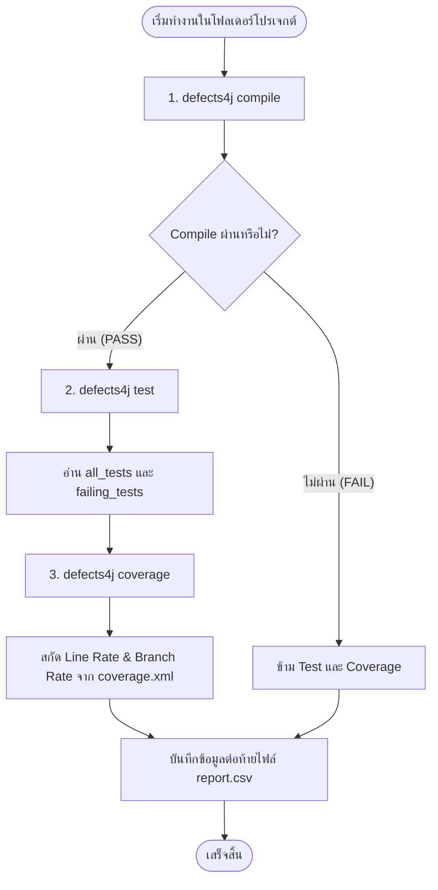

# คู่มือการใช้งาน Script สร้างรายงานผลการทดสอบ (Generate Report)

สคริปต์นี้ถูกออกแบบมาเพื่อรันคำสั่ง **Defects4J** (`compile`, `test`, `coverage`) บนโปรเจกต์ย่อย แล้วสกัดข้อมูลสรุปออกมาเป็นไฟล์ **`report.csv`** โดยอัตโนมัติ

---

## 📌 สารบัญ
1. [ภาพรวมการทำงานของสคริปต์](#1-ภาพรวมการทำงานของสคริปต์)
2. [ข้อกำหนดของระบบปฏิบัติการ (WSL vs Windows vs Mac)](#2-ข้อกำหนดของระบบปฏิบัติการ)
3. [วิธีติดตั้งและเตรียมไฟล์สคริปต์](#3-วิธีติดตั้งและเตรียมไฟล์สคริปต์)
4. [วิธีใช้งานบน WSL (Ubuntu บน Windows) - แนะนำที่สุด](#4-วิธีใช้งานบน-wsl-ubuntu-บน-windows)
5. [วิธีใช้งานบน macOS (Mac)](#5-วิธีใช้งานบน-macos-mac)
6. [การประยุกต์ใช้งานแบบรันทุกโฟลเดอร์พร้อมกัน (Batch Mode)](#6-การประยุกต์ใช้งานแบบรันทุกโฟลเดอร์พร้อมกัน-batch-mode)
7. [โครงสร้างข้อมูลของไฟล์ CSV ที่ได้](#7-โครงสร้างข้อมูลของไฟล์-csv-ที่ได้)
8. [ปัญหาที่พบบ่อยและวิธีแก้ไข (Troubleshooting)](#8-ปัญหาที่พบบ่อยและวิธีแก้ไข)

---

## 1. ภาพรวมการทำงานของสคริปต์

เมื่อรันสคริปต์ในโฟลเดอร์โปรเจกต์ Defects4J (เช่น `~/defect4j/Code/Lang_1_buggy`) สคริปต์จะประมวลผล 3 ลำดับขั้น:



---

## 2. ข้อกำหนดของระบบปฏิบัติการ

| ระบบปฏิบัติการ | รองรับหรือไม่ | คำแนะนำ |
| :--- | :---: | :--- |
| **WSL (Ubuntu บน Windows)** |  **แนะนำ 100%** | เสถียรที่สุดสำหรับฝั่ง Windows รันบน Linux Native Filesystem (`~`) |
| **macOS (Mac)** |  **รองรับ** | รันผ่าน Terminal ได้โดยตรง (ต้องติดตั้ง Defects4J และ Java 11) |
| **Windows Native (PowerShell/CMD)** | ❌ **ไม่รองรับ** | Defects4J ถูกเขียนด้วย Perl/Bash และใช้ Symlink ของ Unix จึงไม่สามารถรันตรงๆ บน Windows ได้ |

---

## 3. ซอร์สโค้ดของสคริปต์ (`generateReport.sh`)

```bash
#!/usr/bin/env bash

# ใช้โฟลเดอร์ปัจจุบันที่ cd เข้าไป
PROJECT_NAME=$(basename "$PWD")
OUTPUT_CSV="report.csv"

echo "=========================================="
echo "Processing: $PROJECT_NAME"
echo "=========================================="

# 1. Compile
echo "Compiling..."
if defects4j compile > /dev/null 2>&1; then
  compile_status="PASS"
else
  compile_status="FAIL"
fi

# 2. Test
tests_total="0"
tests_failed="0"
failed_list="None"

if [ "$compile_status" = "PASS" ]; then
  echo "Running tests..."
  defects4j test > /dev/null 2>&1

  if [ -f "failing_tests" ]; then
    tests_failed=$(grep -c "^---" failing_tests 2>/dev/null || echo "0")
    
    # ดึงชื่อ test ที่ตกมารวมเป็นบรรทัดเดียวคั่นด้วย ';'
    if [ "$tests_failed" -gt 0 ]; then
      failed_list=$(grep "^---" failing_tests | sed 's/^--- //' | tr '\n' ';' | sed 's/;$//')
    fi
  fi

  if [ -f "all_tests" ]; then
    tests_total=$(wc -l < all_tests | tr -d ' ')
  fi
fi

# 3. Coverage
line_cov="N/A"
branch_cov="N/A"

if [ "$compile_status" = "PASS" ]; then
  echo "Running coverage..."
  defects4j coverage > /dev/null 2>&1

  if [ -f "coverage.xml" ]; then
    raw_line=$(grep -m 1 -o 'line-rate="[^"]*"' coverage.xml | cut -d'"' -f2)
    raw_branch=$(grep -m 1 -o 'branch-rate="[^"]*"' coverage.xml | cut -d'"' -f2)

    if [ -n "$raw_line" ]; then
      line_cov=$(awk "BEGIN {printf \"%.2f%%\", $raw_line * 100}")
    fi
    if [ -n "$raw_branch" ]; then
      branch_cov=$(awk "BEGIN {printf \"%.2f%%\", $raw_branch * 100}")
    fi
  fi
fi

# สร้าง Header หากยังไม่มีไฟล์ CSV
if [ ! -f "$OUTPUT_CSV" ]; then
  echo "Project_Folder,Compile_Status,Tests_Total,Tests_Failed,Failed_Test_List,Line_Coverage,Branch_Coverage" > "$OUTPUT_CSV"
fi

# บันทึกข้อมูลลงใน report.csv ของโฟลเดอร์นั้น
echo "$PROJECT_NAME,$compile_status,$tests_total,$tests_failed,\"$failed_list\",$line_cov,$branch_cov" >> "$OUTPUT_CSV"

echo "=========================================="
echo "Done! Report saved to: $PWD/$OUTPUT_CSV"
```

---

## 4. วิธีใช้งานบน WSL (Ubuntu บน Windows)

### ขั้นตอนที่ 1: นำสคริปต์ไปวางใน WSL
เปิด **Ubuntu Terminal** (WSL) แล้วสร้างไฟล์สคริปต์ไว้ที่โฟลเดอร์ส่วนกลาง เช่น `~/defect4j/scripts/`:

```bash
mkdir -p ~/defect4j/scripts
nano ~/defect4j/scripts/generateReport.sh
```
*(วางโค้ดสคริปต์ด้านบนลงไป แล้วกด `Ctrl + O` เพื่อเซฟ และ `Ctrl + X` เพื่อออก)*

### ขั้นตอนที่ 2: ให้สิทธิ์ Execute และแปลง Line Endings
เพื่อป้องกันปัญหา Line Ending แบบ Windows (CRLF) ซึ่งจะทำให้เกิด error `\r: command not found`:

```bash
# ติดตั้ง dos2unix (หากยังไม่มี)
sudo apt install -y dos2unix

# แปลงไฟล์ให้เป็นแบบ Unix (LF) และให้สิทธิ์รัน
dos2unix ~/defect4j/scripts/generateReport.sh
chmod +x ~/defect4j/scripts/generateReport.sh
```

### ขั้นตอนที่ 3: สั่งรันในโฟลเดอร์โปรเจกต์ที่ต้องการ
เข้าไปในโฟลเดอร์ของโปรเจกต์ Defects4J แล้วเรียกใช้สคริปต์:

```bash
# ตัวอย่าง: เข้าไปยังโฟลเดอร์ Lang_1_buggy
cd ~/defect4j/Code/Lang_1_buggy

# สั่งรันสคริปต์
~/defect4j/scripts/generateReport.sh
```

### ขั้นตอนที่ 4: เปิดดูไฟล์ผลลัพธ์บน Windows
เปิดดูโฟลเดอร์ใน Windows File Explorer ได้ทันที:

```bash
explorer.exe .
```
ดับเบิลคลิกเปิดไฟล์ `report.csv` ด้วย Microsoft Excel หรือ Text Editor ได้เลย

---

## 5. วิธีใช้งานบน macOS (Mac)

1. เปิด **Terminal** บน Mac
2. บันทึกสคริปต์ลงในโฟลเดอร์ เช่น `~/defect4j/scripts/generateReport.sh`
3. กำหนดสิทธิ์ Execute:
   ```bash
   chmod +x ~/defect4j/scripts/generateReport.sh
   ```
4. เข้าไปในโฟลเดอร์โปรเจกต์ที่ checkout มาแล้วสั่งรัน:
   ```bash
   cd ~/defect4j/Code/Lang_1_buggy
   bash ~/defect4j/scripts/generateReport.sh
   ```
5. เปิดดูไฟล์ผลลัพธ์ด้วยโปรแกรม Finder หรือ Excel:
   ```bash
   open report.csv
   ```

---

## 6. การประยุกต์ใช้งานแบบรันทุกโฟลเดอร์พร้อมกัน (Batch Mode)

หากคุณมีโฟลเดอร์โปรเจกต์จำนวนมากใน `~/defect4j/Code/` (เช่น `Chart_1_buggy`, `Lang_1_buggy`, `Math_1_buggy` ฯลฯ) และต้องการให้สรุปผลทั้งหมดลงใน **`master_report.csv`** ไฟล์เดียวที่โฟลเดอร์หลัก:

### สคริปต์ Batch Run: `batch_report.sh`

```bash
#!/usr/bin/env bash

TARGET_DIR="$HOME/defect4j/Code"
MASTER_CSV="$TARGET_DIR/master_report.csv"

# สร้าง Header ให้ Master CSV
echo "Project_Folder,Compile_Status,Tests_Total,Tests_Failed,Failed_Test_List,Line_Coverage,Branch_Coverage" > "$MASTER_CSV"

for proj in "$TARGET_DIR"/*; do
    if [ -d "$proj" ]; then
        cd "$proj" || continue
        echo "Processing $(basename "$proj")..."
        
        # รันสคริปต์ generateReport
        ~/defect4j/scripts/generateReport.sh
        
        # คัดลอกแถวข้อมูล (บรรทัดที่ 2) เข้า Master CSV
        if [ -f "report.csv" ]; then
            tail -n +2 "report.csv" >> "$MASTER_CSV"
        fi
    fi
done

echo "All projects finished! Master report created at: $MASTER_CSV"
```

---

## 7. โครงสร้างข้อมูลของไฟล์ CSV ที่ได้

| Header | คำอธิบาย | ตัวอย่างข้อมูล |
| :--- | :--- | :--- |
| **`Project_Folder`** | ชื่อโฟลเดอร์ที่รัน (มักเป็นชื่อโปรเจกต์และเลขบั๊ก) | `Lang_1_buggy` |
| **`Compile_Status`** | ผลการคอมไพล์ (`PASS` หรือ `FAIL`) | `PASS` |
| **`Tests_Total`** | จำนวน Test Cases ทั้งหมดที่รัน | `2144` |
| **`Tests_Failed`** | จำนวน Test Cases ที่ไม่ผ่าน | `1` |
| **`Failed_Test_List`** | รายชื่อเมธอดการทดสอบที่ไม่ผ่าน (คั่นด้วย `;`) | `org.apache.commons.lang3.math.NumberUtilsTest::TestLang617` |
| **`Line_Coverage`** | เปอร์เซ็นต์ความครอบคลุมระดับบรรทัดโค้ด | `89.43%` |
| **`Branch_Coverage`** | เปอร์เซ็นต์ความครอบคลุมระดับ Branch | `83.15%` |

---

## 8. ปัญหาที่พบบ่อยและวิธีแก้ไข (Troubleshooting)

### 1. `$'\r': command not found` หรือ syntax error
* **สาเหตุ:** ไฟล์สคริปต์มี Line Ending เป็น CRLF (แบบ Windows)
* **วิธีแก้:**
  ```bash
  dos2unix ~/defect4j/scripts/generateReport.sh
  ```

### 2. `defects4j: command not found`
* **สาเหตุ:** ยังไม่ได้เพิ่ม Defects4J bin เข้าใน `$PATH`
* **วิธีแก้:**
  ```bash
  echo 'export PATH=$PATH:"$HOME/defect4j/defects4j/framework/bin"' >> ~/.bashrc
  source ~/.bashrc
  ```

### 3. `coverage.xml` แสดงเป็น N/A
* **สาเหตุ:** บางโปรเจกต์ของ Defects4J เช่น `Closure` หรือเวอร์ชันเก่า อาจใช้เครื่องมือ Coverage พิเศษ หรือ Compile ไม่ผ่าน
* **วิธีแก้:** ตรวจสอบว่า `defects4j compile` ผ่านหรือไม่ และลองรัน `defects4j coverage` ด้วยตนเองเพื่อดู Log ข้อความเตือน