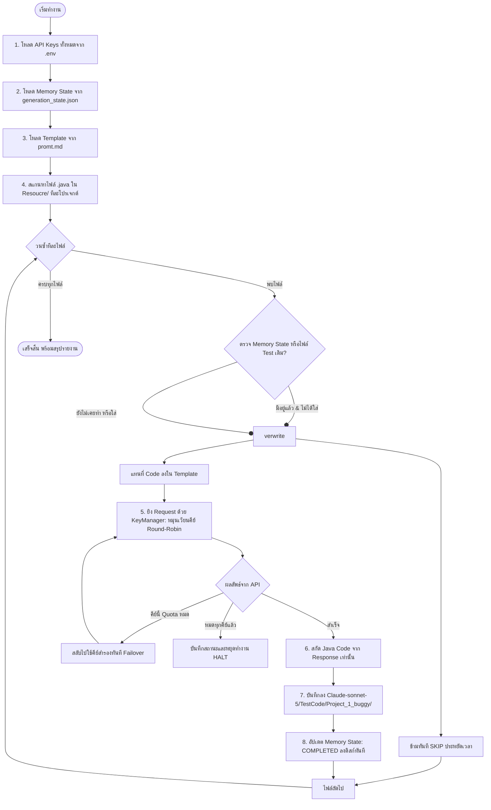

# คู่มือการใช้งาน Script สร้าง JUnit Test ด้วย Claude Sonnet 5 (KKU GenAI)

สคริปต์นี้ถูกออกแบบมาเพื่อนำ Source Code ที่มี Bug จากโฟลเดอร์ **`Resoucre/`** ส่ง Request ไปยัง KKU GenAI API (`https://gen.ai.kku.ac.th/api/v1/chat/completions`) โดยใช้โมเดล **`claude-sonnet-5`** และ Template ใน `Claude-sonnet-5/Promt/promt.md` เพื่อสร้าง JUnit Test Suite อัตโนมัติทีละไฟล์ ทีละโปรเจกต์ แล้วนำโค้ดที่ได้รับจาก Response มาจัดเก็บลงใน **`Claude-sonnet-5/TestCode/<Project>_1_buggy/`**

---

## 📌 สารบัญ
1. [ภาพรวมการทำงานและระบบ Memory State](#1-ภาพรวมการทำงานและระบบ-memory-state)
2. [ระบบรองรับหลาย API Key (Multi-Key Rotation & Failover)](#2-ระบบรองรับหลาย-api-key-multi-key-rotation--failover)
3. [ระบบจัดการ Token / Quota หมด และการรันต่อ (Resume)](#3-ระบบจัดการ-token--quota-หมด-และการรันต่อ-resume)
4. [การตั้งค่า API Key ใน .env](#4-การตั้งค่า-api-key-ใน-env)
5. [วิธีรันคำสั่ง (Usage Examples)](#5-วิธีรันคำสั่ง-usage-examples)
6. [พารามิเตอร์ทั้งหมด (CLI Arguments)](#6-พารามิเตอร์ทั้งหมด-cli-arguments)
7. [ข้อควรระวังและระบบความปลอดภัยของโค้ด](#7-ข้อควรระวังและระบบความปลอดภัยของโค้ด)

---

## 1. ภาพรวมการทำงานและระบบ Memory State

สคริปต์มีระบบ **Memory State Tracking** ในไฟล์ `Claude-sonnet-5/generation_state.json` ซึ่งจะบันทึกสถานะของแต่ละไฟล์ (COMPLETED / FAILED / tokens / เวลาที่รัน) ทันทีหลังประมวลผลเสร็จในแต่ละไฟล์ หากโปรแกรมหยุดกลางคัน หรือ Token หมด เมื่อสั่งรันใหม่จะข้ามไฟล์ที่สำเร็จแล้วทันที ไม่เสียเวลาและไม่เสีย Token ซ้ำซ้อน



---

## 2. ระบบรองรับหลาย API Key (Multi-Key Rotation & Failover)

สคริปต์รองรับการใส่หลาย API Key พร้อมกันเพื่อกระจายโหลดและป้องกันปัญหางานสะดุด:

1. **Round-Robin Load Balancing**:
   - สลับใช้งานคีย์ถัดไปอัตโนมัติในแต่ละ Request (เช่น Request 1 ใช้ Key 1, Request 2 ใช้ Key 2, Request 3 ใช้ Key 1 ...)
   - ช่วยลดความเสี่ยงจากการติด Rate Limit ของแต่ละคีย์

2. **Auto-Failover เมื่อคีย์ใดคีย์หนึ่งโควต้าหมด**:
   - หากคีย์ปัจจุบันเจอ HTTP 429 หรือโควต้าหมด สคริปต์จะ **ตัดคีย์นั้นออกจากคิวทันที**
   - สลับไปใช้คีย์สำรองถัดไปเพื่อยิง Request นั้นต่อทันทีโดยไม่ต้องเริ่มใหม่
   - จะหยุดทำงานเฉพาะเมื่อ **ทุกคีย์ที่มีในระบบหมดโควต้าแล้วจริงๆ เท่านั้น**

---

## 3. ระบบจัดการ Token / Quota หมด และการรันต่อ (Resume)

### 🛑 กรณี Token / Quota หมดทุกคีย์:
1. สคริปต์จะตรวจสอบ Error `insufficient_quota`, `exceeded your current quota`, `HTTP 402` หรือ `HTTP 429`
2. หากคีย์ทั้งหมดหมดโควต้า สคริปต์จะ **หยุดการทำงานทันที (HALT)** และบันทึกสถานะไฟล์ล่าสุดไว้ใน `Claude-sonnet-5/generation_state.json`

### 🔄 การรันต่อหลังจากเติม Token หรือเปลี่ยนคีย์:
- เพียงรันคำสั่งเดิม:
  ```bash
  python script/generate_claude_tests.py
  ```
- สคริปต์จะอ่าน Memory State และ **ข้าม (SKIP) ทุกไฟล์ที่ทำเสร็จไปแล้วโดยอัตโนมัติ** และจะเริ่มทำงานต่อที่ไฟล์ที่ค้างอยู่ทันที

### ⌨️ กรณีผู้ใช้กดหยุดเอง (Ctrl+C):
- สคริปต์มี Handler ดักจับ `KeyboardInterrupt` เพื่อบันทึกสถานะล่าสุดลงดิสก์ก่อนปิดโปรแกรมเสมอ ข้อมูลไม่สูญหายแน่นอน

---

## 4. การตั้งค่า API Key ใน .env

สคริปต์รองรับรูปแบบการใส่คีย์ในไฟล์ `.env` ได้หลายแบบ:

### แบบที่ 1: แยกรายบรรทัด (แนะนำ)
```env
API_KEY=sk_E3pJjTWdbtdZ7TPB2IGkonjaYFbkhvnjYNIRUardUM0uRVelBBkZ7RNKL4wHDrbt
API_KEY2=sk_nWIdRGlat6gkYVqUWjM5fEYfE4I4mP6wN10ITjNt6bniGmph14qw3aMj1b7X6ADW
API_KEY3=sk_อีกคีย์หนึ่ง...
```

### แบบที่ 2: คั่นด้วยจุลภาค (Comma-separated)
```env
API_KEYS=sk_key1...,sk_key2...,sk_key3...
```

---

## 5. วิธีรันคำสั่ง (Usage Examples)

### 5.1 ตรวจสอบสถานะความคืบหน้าและสถานะคีย์ API (`--status`)
ดูว่ามีคีย์ไหนใช้งานได้บ้าง ไฟล์ไหนเสร็จแล้ว ไฟล์ไหนค้างอยู่ โดยไม่ยิง API:
```bash
python script/generate_claude_tests.py --status
```

### 5.2 ทดสอบก่อนรันจริง (Dry-Run Mode)
แสดงรายการไฟล์ที่จะถูกประมวลผลทั้งหมดโดยยังไม่ยิง API:
```bash
python script/generate_claude_tests.py --dry-run
```

### 5.3 รันต่อเนื่องจากจุดเดิม (Resume / Run All)
```bash
python script/generate_claude_tests.py
```

### 5.4 รันเฉพาะโปรเจกต์ที่ต้องการ (เช่น Codec_1 หรือ Chart_1)
```bash
python script/generate_claude_tests.py --project Codec_1
```

### 5.5 ระบุ API Keys ผ่าน Command line โดยตรง
```bash
python script/generate_claude_tests.py -k "sk_key1..." -k "sk_key2..."
```

### 5.6 บังคับสร้างใหม่ทั้งหมด (`--overwrite`)
ละเว้น Memory State และบังคับยิงสร้างใหม่ทุกไฟล์:
```bash
python script/generate_claude_tests.py --overwrite
```

### 5.7 ล้าง Memory State เพื่อเริ่มต้นนับหนึ่งใหม่ (`--reset-state`)
```bash
python script/generate_claude_tests.py --reset-state
```

### 5.8 ดูโค้ดที่โมเดลกำลังเขียนแบบสตรีมสดลงหน้าจอ (`-v` หรือ `--show-stream`)
```bash
python script/generate_claude_tests.py --project Codec_1 -v
```

---

## 6. พารามิเตอร์ทั้งหมด (CLI Arguments)

| Argument | ชนิด | ค่าเริ่มต้น | คำอธิบาย |
| :--- | :--- | :--- | :--- |
| `--status` | flag | `False` | แสดงรายงานความคืบหน้าปัจจุบัน (Completed/Pending/Failed) และสถานะคีย์ทั้งหมด |
| `--reset-state` | flag | `False` | ล้างประวัติ Memory State เริ่มต้นใหม่ |
| `--state-file` | string | `Claude-sonnet-5/generation_state.json` | กำหนดตำแหน่งไฟล์บันทึกสถานะ Memory |
| `--project`, `-p` | string | `None` | ระบุชื่อโปรเจกต์ เช่น `Codec_1`, `Chart_1` (ไม่ระบุ = ทุกโปรเจกต์) |
| `--file`, `-f` | string | `None` | ระบุชื่อไฟล์เฉพาะ เช่น `Caverphone.java` |
| `--api-key`, `-k` | string (list) | `[]` | API Key (สามารถระบุซ้ำได้หลายครั้ง `-k key1 -k key2`) |
| `--env-file` | string | `None` | ระบุพาธไฟล์ `.env` เอง |
| `--overwrite` | flag | `False` | บังคับเขียนทับและสร้างใหม่ แม้เคยทำเสร็จแล้วใน Memory หรือมีไฟล์บนดิสก์ |
| `--delay` | float | `2.0` | หน่วงเวลาระหว่าง Request แต่ละครั้ง (วินาที) ป้องกัน Rate Limit |
| `--dry-run` | flag | `False` | โหมดจำลอง แสดงรายการไฟล์และ Prompt โดยไม่ยิง API |
| `--model` | string | `claude-sonnet-5` | โมเดลที่ต้องการเรียกใช้ |
| `--timeout` | int | `60` | เวลา Timeout สูงสุดต่อ Request (วินาที) ตัดจบและ Failover คีย์เร็วขึ้น |
| `--sort-by-size` | flag | `False` | จัดเรียงคิวงานตามขนาดไฟล์ (Smallest first) ทำไฟล์เล็กก่อนไฟล์ใหญ่ |
| `--no-auto-compact`| flag | `False` | ปิดระบบย่อโค้ดอัตโนมัติ (ตัด Javadoc/Comments) สำหรับคลาสขนาดใหญ่ |
| `--check-quota` | flag | `False` | ตรวจสอบโควต้าคงเหลือจริง (Real-time Token Quota) ของทุก API Key จากเซิร์ฟเวอร์ KKU |

---

## 7. ข้อควรระวังและระบบความปลอดภัยของโค้ด

1. **ใช้เฉพาะโค้ดที่ได้รับจาก Response เท่านั้น**: สคริปต์จะสกัดโค้ด Java จากข้อความที่ได้จากโมเดล Claude Sonnet 5 จริงๆ เท่านั้น ไม่มีการ fabricate, mock หรือสร้างโค้ดทดแทนเองเด็ดขาด
2. **Auto Markdown Fence Stripping**: สคริปต์รองรับทั้ง Response ที่ส่งมาเป็น Java ล้วน และ Response ที่ครอบด้วย markdown code block (```` ```java ... ``` ````) โดยจะตัด fence ออกให้เหลือเฉพาะโค้ด Java แท้ที่พร้อม compile
3. **Atomic State Writing**: การบันทึก Memory ใช้การเขียนลงไฟล์ Temp ก่อนแล้วทำการ Replace ป้องกันไฟล์ State เสียหายแม้ไฟดับหรือโปรแกรมถูกปิดกะทันหัน
