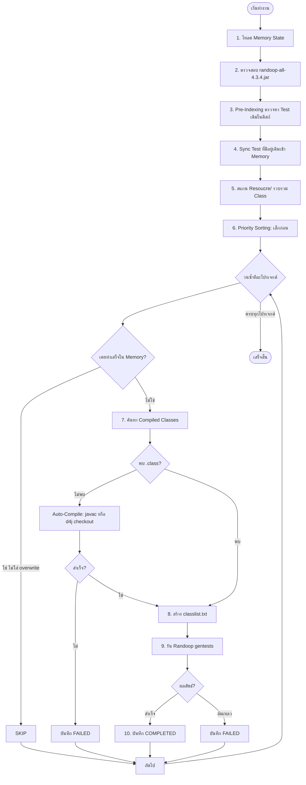

# คู่มือการใช้งาน Script สร้าง JUnit Test ด้วย Randoop (Feedback-Directed Random Testing)

สคริปต์นี้ถูกออกแบบมาเพื่อนำ Source Code ในโฟลเดอร์ **`Resoucre/`** (รองรับทั้ง 840+ โฟลเดอร์โปรเจกต์ เช่น `Codec_1`, `Chart_1` ฯลฯ) มาสร้างชุดทดสอบ **JUnit Test Suite** อัตโนมัติด้วยเครื่องมือ **Randoop (Feedback-Directed Random Test Generation)** แล้วจัดเก็บผลลัพธ์ลงในโฟลเดอร์ **`Feedback-Directed Random Test Generation/TestCode/<Project>_buggy/`**

> ✅ **สคริปต์รันได้บนทุกเครื่อง** — ไม่ต้องมีโฟลเดอร์ `data/` ในเครื่อง สามารถระบุ path ของ Defects4J code ผ่าน `--data-dir` หรือ environment variable `D4J_DATA_DIR` หรือปล่อยให้ระบบ auto-checkout อัตโนมัติ

---

## 📌 สารบัญ
1. [ภาพรวมการทำงานและระบบ Memory State](#1-ภาพรวม)
2. [รูปแบบคำสั่ง Randoop Gentests](#2-รูปแบบคำสั่ง)
3. [การค้นหาและจัดการ Classpath (Compiled Classes)](#3-classpath)
4. [ตำแหน่งไฟล์ Randoop JAR](#4-randoop-jar)
5. [วิธีรันคำสั่ง (Usage Examples)](#5-usage-examples)
6. [พารามิเตอร์ทั้งหมด (CLI Arguments)](#6-cli-arguments)
7. [การทำงานร่วมกับ Defect4J และการแก้ปัญหาที่พบบ่อย](#7-defect4j)

---

## 1. ภาพรวมการทำงานและระบบ Memory State

สคริปต์มีระบบ **Memory State Tracking** ในไฟล์ `Feedback-Directed Random Test Generation/generation_state.json` ซึ่งจะบันทึกสถานะของแต่ละโปรเจกต์ (`COMPLETED` / `FAILED` / รายชื่อไฟล์ Test ที่สร้าง / เวลาที่ใช้) หากหยุดกลางคัน เมื่อสั่งรันใหม่จะข้ามโปรเจกต์ที่ทำเสร็จแล้วทันทีโดยอัตโนมัติ



---

## 2. รูปแบบคำสั่ง Randoop Gentests

สคริปต์จะประกอบและรันคำสั่ง Randoop gentests ตามรูปแบบมาตรฐาน:

```bash
java -Xmx3000m -cp RANDOOP_JAR;CLASSES_DIR randoop.main.Main gentests \
     --classlist=classlist.txt \
     --junit-package-name=PACKAGE \
     --junit-output-dir=OUTPUT_DIR \
     --time-limit=SECONDS \
     --testsperfile=500
```

- **`--classlist`**: FQCN ของทุกไฟล์ `.java` ในโปรเจกต์ รวมในไฟล์ข้อความชั่วคราว
- **`--junit-package-name`**: Package ของไฟล์ทดสอบตาม Package ของคลาสที่ถูกทดสอบ
- **`--junit-output-dir`**: `Feedback-Directed Random Test Generation/TestCode/<Project>_buggy/`
- **`--time-limit`**: ระยะเวลาสร้างชุดทดสอบ (ค่าเริ่มต้น: 60 วินาที)

---

## 3. การค้นหาและจัดการ Classpath (Compiled Classes & Auto-Compile)

Randoop ต้องการ **Bytecode (.class)** ที่คอมไพล์แล้วในการสร้างเทสต์ สคริปต์มีระบบ **Auto-Discovery & On-The-Fly Compilation** หลายระดับ (Multi-Tier) และ**ไม่ขึ้นกับ path ใด path หนึ่ง**:

### ลำดับการค้นหา (Fallback Chain)

| ลำดับ | ที่ค้นหา | หมายเหตุ |
| :---: | :--- | :--- |
| 1 | `--classes-dir` ที่ผู้ใช้ระบุผ่าน CLI | ความสำคัญสูงสุด |
| 2 | `BuildClasses/<ProjectName>/` | แคชถาวรในโปรเจกต์ ไม่มีช่องว่าง |
| 3 | `--data-dir/<ProjectName>1buggy/target/classes` | กำหนดผ่าน `--data-dir` หรือ `D4J_DATA_DIR` |
| 4 | `~/defect4j/Code/<ProjectName>1buggy/...` | Linux/Mac standard path |
| 5 | `/tmp/sqa_d4j_work/` | temp จาก checkout ครั้งก่อน |
| 6 | Auto-compile ด้วย `javac` | คอมไพล์ทันที บันทึกใน `BuildClasses/` |
| 7 | `defects4j checkout` + `defects4j compile` | Tier สุดท้าย ต้องมี `defects4j` ใน PATH |

> **ไม่ต้องมีโฟลเดอร์ `data/` ในโปรเจกต์** — ถ้าไม่ระบุ `--data-dir` สคริปต์จะข้ามไปที่ Tier 6-7 อัตโนมัติ

### การระบุ Data Directory

```bash
# วิธีที่ 1: ผ่าน CLI argument
python script/generate_randoop_tests.py --data-dir /path/to/defects4j_projects

# วิธีที่ 2: ผ่าน Environment Variable
# Linux/Mac:
export D4J_DATA_DIR=/path/to/defects4j_projects
# Windows:
set D4J_DATA_DIR=C:\defects4j_projects

python script/generate_randoop_tests.py
```

---

## 4. ตำแหน่งไฟล์ Randoop JAR และการจัดการ Path ที่มี Space

1. สคริปต์รองรับการค้นหาไฟล์ `randoop-all-4.3.4.jar` อัตโนมัติจากตำแหน่งต่อไปนี้:
   - ค่าเริ่มต้นหลักภายในโปรเจกต์: `Feedback-Directed Random Test Generation/Configuration/randoop-all-4.3.4.jar`
   - ระบุผ่าน CLI พารามิเตอร์: `--randoop-jar PATH`
   - ค่าเริ่มต้นสำรองบน Windows: `C:\randoop\randoop-all-4.3.4.jar`
2. **Output Staging**: ทุกโปรเจกต์สร้าง Test ในไดเรกทอรีชั่วคราวเฉพาะรอบ (เช่น `/tmp/sqa_randoop/Codec_13-.../`) และคัดลอก `.java` ไป `TestCode/<Project>_buggy/` เฉพาะเมื่อ Randoop สำเร็จและมีไฟล์ Test
3. หลังสร้างไฟล์ Test สำเร็จและบันทึกสถานะแล้ว สคริปต์จะลบ staging ของโปรเจกต์, checkout ชั่วคราว และ `BuildClasses/<Project>/` ที่ใช้คอมไพล์ โดยเก็บไฟล์ Test ใน `TestCode/` ไว้ การรันซ้ำด้วย `--overwrite` อาจต้องคอมไพล์ใหม่
4. เมื่อกด Ctrl+C ระหว่างสร้าง Test (รวมถึงการยกเลิกผ่าน parallel launcher) สคริปต์จะหยุด Java และลบ staging ของรอบนั้น โดยไม่สร้างโฟลเดอร์ TestCode ของโปรเจกต์ที่ยังไม่สำเร็จ ไฟล์ Test เดิมที่มีอยู่จะยังอยู่ ส่วน BuildClasses/checkout ที่สร้างก่อนเริ่ม Randoop อาจยังคงอยู่เพื่อให้รันต่อได้

---

## 5. วิธีรันคำสั่ง (Usage Examples)

### 5.1 ทดสอบจำลองคำสั่งก่อนรันจริง (Dry-Run Mode)
```bash
python script/generate_randoop_tests.py --dry-run -n 5
```

### 5.2 รันเฉพาะโปรเจกต์ที่ต้องการ
```bash
python script/generate_randoop_tests.py --project Mockito_2 --time-limit 60
# รันทุกเวอร์ชันในกลุ่ม Mockito (เช่น Mockito_1 ถึง Mockito_38)
python script/generate_randoop_tests.py --project Mockito --time-limit 60
```

### 5.3 รันโดยระบุตำแหน่งโฟลเดอร์ Compiled Classes เอง
```bash
python script/generate_randoop_tests.py --project Codec_1 -cp /path/to/Codec1buggy/target/classes
```

### 5.4 ตรวจสอบสถานะความคืบหน้า
```bash
python script/generate_randoop_tests.py --status
```

### 5.5 รันแบบกำหนดจำนวนโปรเจกต์ต่อรอบ
```bash
python script/generate_randoop_tests.py -n 10 --time-limit 30
```

### 5.6 บังคับสร้างใหม่ทับของเดิม
```bash
python script/generate_randoop_tests.py --project Codec_1 --overwrite
```

### 5.7 ล้าง Memory State เริ่มต้นใหม่
```bash
python script/generate_randoop_tests.py --reset-state
```

### 5.8 รันบนเครื่องอื่น ระบุโฟลเดอร์ data ที่แตกต่างออกไป (`--data-dir`)
```bash
# เครื่อง A: data อยู่ที่ D:\d4j_projects
python script/generate_randoop_tests.py --data-dir D:\d4j_projects

# เครื่อง B: ไม่มี data folder เลย ระบบจะ auto-checkout จาก defects4j
python script/generate_randoop_tests.py

# เครื่อง C (Linux): ตั้ง env var ถาวร
export D4J_DATA_DIR=~/defect4j_projects
python script/generate_randoop_tests.py -n 20
```

### 5.9 การรันบน WSL / Linux ผ่าน Bash Wrapper
```bash
bash script/generate_randoop_tests.sh -n 10 --time-limit 60
```

### 5.10 รันหลายกลุ่มพร้อมกัน (แยก State แบบ DeepSeek)

หยุด generator ของ Randoop ที่รันอยู่ก่อน แล้วเรียก launcher จาก WSL เพียงครั้งเดียว แต่ละ worker รับกลุ่มโปรเจกต์ไม่ซ้ำกัน และบันทึกสถานะแยกที่ `Feedback-Directed Random Test Generation/state/<กลุ่ม>.json` เมื่อเริ่ม launcher จะรวมผลเดิมจาก `generation_state.json` เข้ากับ state แยกโดยเก็บรายการที่มี timestamp ใหม่กว่า การเรียกคำสั่งเดิมอีกครั้งจะข้ามรายการที่สำเร็จแล้ว

Launcher จะรวมความคืบหน้ากลับไปที่ `generation_state.json` ทุก 10 วินาที เมื่อกลุ่มงานจบ และก่อนออกจากโปรแกรม เพื่อให้ `python3 script/generate_randoop_tests.py --status` กับระบบข้ามงานเดิมยังเห็นผลล่าสุดจาก worker โดยไม่ต้องอ่านไฟล์ state แยกเอง `--status` และ `--dry-run` ของ launcher อ่านอย่างเดียวและไม่อัปเดตไฟล์

```bash
python3 script/run_randoop_parallel.py --workers 2
python3 script/run_randoop_parallel.py --workers 2 --projects Cli Chart
python3 script/run_randoop_parallel.py --workers 2 --projects Cli Chart --dry-run
python3 script/run_randoop_parallel.py --projects Cli Chart --status
```

ใช้ `--time-limit 60`, `--jvm-memory 3000m`, `--data-dir PATH` และ `--overwrite` ได้เช่นเดียวกับ generator เดิม `--jvm-memory` เป็นค่าต่อ worker จึงควรกำหนดจำนวน worker ตาม RAM ที่มี Launcher ส่งคืนรหัส 1 หากกลุ่มใดยังมี `FAILED` หรือ `PENDING` อยู่ ผล `FAILED` เดิม (เช่น `Mockito_14` และ `Mockito_16`) จะยังเป็น `FAILED` ใน state แยก และการรันจะลองใหม่ด้วย Randoop ค่าเดิมโดยไม่มีข้อยกเว้นเฉพาะโปรเจกต์

---

## 6. พารามิเตอร์ทั้งหมด (CLI Arguments)

| Argument | Shorthand | ค่าเริ่มต้น | คำอธิบาย |
| :--- | :--- | :--- | :--- |
| `--project` | `-p` | `None` | ระบุชื่อโปรเจกต์ เช่น `Mockito_2` หรือชื่อกลุ่ม เช่น `Mockito` เพื่อเลือกทุกเวอร์ชัน (ไม่ระบุ = ทุกโปรเจกต์) |
| `--time-limit` | `-t` | `60` | ระยะเวลาสร้างเทสต์ต่อโปรเจกต์ (วินาที) |
| `--classes-dir` | `-cp` | Auto-detect | ตำแหน่งโฟลเดอร์ compiled `.class` (เช่น `target/classes` หรือ `build/classes`) |
| `--randoop-jar` | - | Auto-detect | พาธไฟล์ `randoop-all-4.3.4.jar` |
| `--output-dir` | - | `Feedback-Directed.../TestCode` | โฟลเดอร์ปลายทางสำหรับจัดเก็บ Test Code |
| `--resource-dir` | - | `Resoucre/` | โฟลเดอร์ต้นทางที่เก็บ Source Code ของโปรเจกต์ |
| `--data-dir` | - | `D4J_DATA_DIR` env / None | **[ใหม่]** โฟลเดอร์ที่เก็บโค้ด Defects4J ที่ checkout แล้ว ถ้าไม่ระบุจะใช้ defects4j auto-checkout |
| `--limit` | `-n` | `None` | จำกัดจำนวนโปรเจกต์ที่จะประมวลผลในรอบนี้ |
| `--status` | - | `False` | แสดงรายงานความคืบหน้า (Completed/Pending/Failed) แล้วหยุดทำงาน |
| `--dry-run` | - | `False` | โหมดจำลอง แสดงคำสั่งโดยไม่เรียกใช้งาน Java จริง |
| `--overwrite` | - | `False` | บังคับสร้างเทสต์ใหม่ แม้เคยทำเสร็จแล้วใน Memory |
| `--reset-state` | - | `False` | ล้างข้อมูล Memory State ทั้งหมดเริ่มต้นใหม่ |
| `--sort-by-size` | - | `True` | จัดคิวทำโปรเจกต์ขนาดเล็กก่อน (Smallest first, ค่าเริ่มต้น) |
| `--no-sort-by-size` | - | `False` | ปิดการจัดเรียงตามขนาด (ใช้ลำดับโฟลเดอร์เดิม) |
| `--no-auto-compile` | - | `False` | ปิดการ Auto-compile `.class` อัตโนมัติ |
| `--skip-missing` | - | `False` | ข้ามโปรเจกต์ที่ไม่พบคลาส `.class` โดยไม่บันทึกเป็น FAILED |
| `--tests-per-file` | - | `500` | จำนวนเทสต์สูงสุดต่อ 1 ไฟล์ JUnit |
| `--jvm-memory` | - | `3000m` | ขนาดหน่วยความจำ JVM สูงสุด (เช่น `3000m` หรือ `4g`) |
| `--state-file` | - | Auto | พาธไฟล์บันทึก Memory State |

---

## 7. การทำงานร่วมกับ Defect4J และการแก้ปัญหาที่พบบ่อย

### รันได้บนทุกเครื่อง (Portability)

สคริปต์ **ไม่ผูกกับโฟลเดอร์ `data/`** แล้ว ระบบจะค้นหา `.class` ตามลำดับดังนี้:

1. **มีโฟลเดอร์ data อยู่แล้ว** — ระบุผ่าน `--data-dir PATH` หรือ set env `D4J_DATA_DIR`
2. **ไม่มีโฟลเดอร์ data** — ระบบจะพยายาม auto-compile จาก Source ใน `Resoucre/` ก่อน จากนั้นใช้ `defects4j checkout` + compile อัตโนมัติ (ต้องมี `defects4j` ใน PATH)
3. **ผลลัพธ์ถูกแคชไว้** ใน `BuildClasses/<Project>/` เสมอ ทำให้รันครั้งต่อไปเร็วกว่า

### การคอมไพล์คลาสอัตโนมัติ (Automatic On-The-Fly Compilation)
- สคริปต์จะตรวจจับคลาสที่ยังไม่มี `.class` อัตโนมัติ และทำการคอมไพล์ผ่าน `javac` โดยอิง JAR dependencies จาก `--data-dir/<Project>1buggy/target/dependency` และจัดเก็บไว้ใน `BuildClasses/<Project>` ทันที

### กรณีแจ้งเตือน `[MISSING CLASSES] ไม่พบโฟลเดอร์ compiled .class`
- หากปิด auto-compile หรือคอมไพล์ล้มเหลว สามารถแก้ไขได้โดย:
  1. ระบุ path โฟลเดอร์ที่เก็บโค้ดไว้ผ่าน `--data-dir PATH`
  2. หรือเข้าไปยังโฟลเดอร์โปรเจกต์นั้น แล้วรันคำสั่ง `defects4j compile`
  3. สั่งรันสคริปต์อีกครั้ง สคริปต์จะตรวจพบโฟลเดอร์ `.class` อัตโนมัติ

### กรณีเจอข้อผิดพลาด `OutOfMemoryError` ในคลาสขนาดใหญ่
- สามารถเพิ่มขนาด Heap Memory ของ JVM ผ่านพารามิเตอร์ `--jvm-memory`:
  ```bash
  python script/generate_randoop_tests.py --project Chart_1 --jvm-memory 4g
  ```
