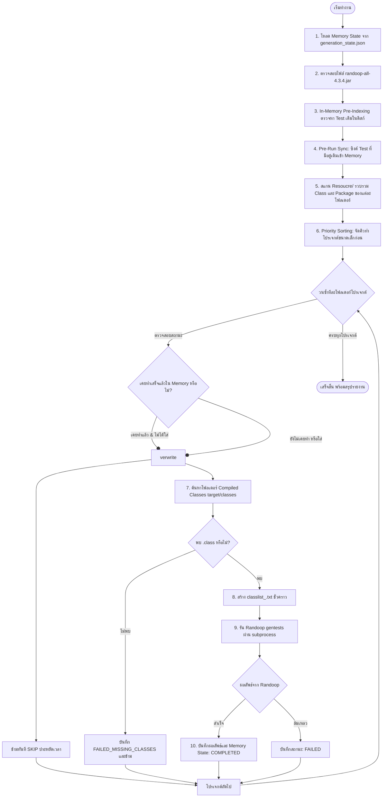

# คู่มือการใช้งาน Script สร้าง JUnit Test ด้วย Randoop (Feedback-Directed Random Testing)

สคริปต์นี้ถูกออกแบบมาเพื่อนำ Source Code ในโฟลเดอร์ **`Resoucre/`** (รองรับทั้ง 840+ โฟลเดอร์โปรเจกต์ เช่น `Codec_1`, `Chart_1` ฯลฯ) มาสร้างชุดทดสอบ **JUnit Test Suite** อัตโนมัติด้วยเครื่องมือ **Randoop (Feedback-Directed Random Test Generation)** แล้วจัดเก็บผลลัพธ์ลงในโฟลเดอร์ **`Feedback-Directed Random Test Generation/TestCode/<Project>_buggy/`**

---

## 📌 สารบัญ
1. [ภาพรวมการทำงานและระบบ Memory State](#1-ภาพรวมการทำงานและระบบ-memory-state)
2. [รูปแบบคำสั่ง Randoop Gentests](#2-รูปแบบคำสั่ง-randoop-gentests)
3. [การค้นหาและจัดการ Classpath (Compiled Classes)](#3-การค้นหาและจัดการ-classpath-compiled-classes)
4. [ตำแหน่งไฟล์ Randoop JAR](#4-ตำแหน่งไฟล์-randoop-jar)
5. [วิธีรันคำสั่ง (Usage Examples)](#5-วิธีรันคำสั่ง-usage-examples)
6. [พารามิเตอร์ทั้งหมด (CLI Arguments)](#6-พารามิเตอร์ทั้งหมด-cli-arguments)
7. [การทำงานร่วมกับ Defect4J และการแก้ปัญหาที่พบบ่อย](#7-การทำงานร่วมกับ-defect4j-และการแก้ปัญหาที่พบบ่อย)

---

## 1. ภาพรวมการทำงานและระบบ Memory State

สคริปต์มีระบบ **Memory State Tracking** ในไฟล์ `Feedback-Directed Random Test Generation/generation_state.json` ซึ่งจะบันทึกสถานะของแต่ละโปรเจกต์ (`COMPLETED` / `FAILED` / รายชื่อไฟล์ Test ที่สร้าง / เวลาที่ใช้) หากหยุดกลางคัน เมื่อสั่งรันใหม่จะข้ามโปรเจกต์ที่ทำเสร็จแล้วทันทีโดยอัตโนมัติ



---

## 2. รูปแบบคำสั่ง Randoop Gentests

สคริปต์จะประกอบและรันคำสั่ง Randoop gentests ตามรูปแบบมาตรฐาน:

```bash
java -Xmx3000m -cp "<randoop.jar>;<classes_dir>" randoop.main.Main gentests \
     --classlist=<classlist.txt> \
     --junit-package-name=<package_name> \
     --junit-output-dir=<output_dir> \
     --time-limit=<seconds> \
     --testsperfile=500
```

- **`--classlist`**: สคริปต์จะดึง Fully Qualified Class Name (FQCN) ของทุกไฟล์ `.java` ในโฟลเดอร์โปรเจกต์นั้นมารวมในไฟล์ข้อความชั่วคราว
- **`--junit-package-name`**: กำหนดชื่อ Package ของไฟล์ทดสอบตาม Package ของคลาสที่ถูกทดสอบ
- **`--junit-output-dir`**: ชี้ไปยังโฟลเดอร์ `Feedback-Directed Random Test Generation/TestCode/<Project>_buggy/`
- **`--time-limit`**: ระยะเวลาสร้างชุดทดสอบ (ค่าเริ่มต้น: 60 วินาที)

---

## 3. การค้นหาและจัดการ Classpath (Compiled Classes & Auto-Compile)

Randoop ต้องการ **Bytecode (.class)** ที่คอมไพล์แล้วในการสร้างเทสต์ สคริปต์มีระบบ **Auto-Discovery & On-The-Fly Compilation** หลายระดับ (Multi-Tier):

1. **ลำดับการค้นหาอัตโนมัติ (Tier 1)**:
   - ตรวจสอบใน `BuildClasses/<ProjectName>` (โฟลเดอร์แคชที่สคริปต์คอมไพล์ไว้)
   - `data/<ProjectName><BugNum>buggy/target/classes` (เช่น `Codec_1` ค้นหาที่ `data/Codec1buggy/target/classes`)
   - `data/<ProjectName><BugNum>buggy/build/classes`
   - `data/<ProjectName><BugNum>buggy/classes`
   - `~/defect4j/Code/<ProjectName><BugNum>buggy/...` หรือ `Code/<ProjectName><BugNum>buggy/...`
2. **ระบบ On-the-Fly Fast Javac Auto-Compile (Tier 2)**:
   - หากโปรเจกต์ไม่มี `.class` ในโฟลเดอร์ `data/` (เช่น `Mockito_2`, `Mockito_12`) สคริปต์จะคอมไพล์ไฟล์ `.java` ใน `Resoucre/<Project>` แบบทันทีด้วย `javac` โดยดึง classpath จาก base bug (เช่น `Mockito1buggy`) แล้วบันทึกไว้ใน `BuildClasses/<Project>` เพื่อให้พร้อมใช้ทันที
3. **ระบบ Defect4J Auto-Checkout & Compile (Tier 3)**:
   - หากคลาสต้องการ dependencies ซับซ้อนและมี `defects4j` ใน PATH / `~/defect4j` สคริปต์สามารถสั่ง checkout และ compile บั๊กเวอร์ชันนั้นๆ แบบอัตโนมัติ
4. **การระบุตำแหน่งเองผ่าน CLI**:
   - สามารถระบุได้โดยตรงผ่าน `--classes-dir` หรือ `-cp`:
     ```bash
     python script/generate_randoop_tests.py --project Codec_1 --classes-dir data/Codec1buggy/target/classes
     ```

---

## 4. ตำแหน่งไฟล์ Randoop JAR และการจัดการ Path ที่มี Space

1. สคริปต์รองรับการค้นหาไฟล์ `randoop-all-4.3.4.jar` อัตโนมัติจากตำแหน่งต่อไปนี้:
   - ค่าเริ่มต้นหลักภายในโปรเจกต์: `Feedback-Directed Random Test Generation/Configuration/randoop-all-4.3.4.jar`
   - ระบุผ่าน CLI พารามิเตอร์: `--randoop-jar <path_to_jar>`
   - ค่าเริ่มต้นสำรองบน Windows: `C:\randoop\randoop-all-4.3.4.jar`
2. **Space-Safe Staging**: หากพาธโฟลเดอร์มีช่องว่าง (เช่น `Feedback-Directed Random Test Generation`) สคริปต์จะทำการ Stage ไปรันในไดเรกทอรีชั่วคราวที่ไม่มีเว้นวรรค (เช่น `/tmp/sqa_randoop/`) โดยอัตโนมัติ เพื่อป้องกันไม่ให้ Sub-JVM ของ Randoop แตก Command Classpath แล้วคัดลอกไฟล์ผลลัพธ์ `.java` กลับมาให้โดยอัตโนมัติ

---

## 5. วิธีรันคำสั่ง (Usage Examples)

### 5.1 ทดสอบจำลองคำสั่งก่อนรันจริง (Dry-Run Mode)
แสดงคำสั่งและโครงสร้างคลาสของ 5 โปรเจกต์แรกโดยยังไม่รัน Java:
```bash
python script/generate_randoop_tests.py --dry-run -n 5
```

### 5.2 รันเฉพาะโปรเจกต์ที่ต้องการ (เช่น Codec_1 หรือ Mockito_2)
```bash
python script/generate_randoop_tests.py --project Mockito_2 --time-limit 60
```

### 5.3 รันโดยระบุตำแหน่งโฟลเดอร์ Compiled Classes เอง
```bash
python script/generate_randoop_tests.py --project Codec_1 -cp data/Codec1buggy/target/classes
```

### 5.4 ตรวจสอบสถานะความคืบหน้าของทุกโปรเจกต์ (`--status`)
```bash
python script/generate_randoop_tests.py --status
```

### 5.5 รันแบบกำหนดจำนวนโปรเจกต์ต่อรอบ (`-n` หรือ `--limit`)
```bash
python script/generate_randoop_tests.py -n 10 --time-limit 30
```

### 5.6 บังคับสร้างใหม่ทั้งหมดทับของเดิม (`--overwrite`)
```bash
python script/generate_randoop_tests.py --project Codec_1 --overwrite
```

### 5.7 ล้าง Memory State เริ่มต้นใหม่ (`--reset-state`)
```bash
python script/generate_randoop_tests.py --reset-state
```

### 5.8 การรันบน WSL / Linux ผ่าน Bash Wrapper
```bash
bash script/generate_randoop_tests.sh -n 10 --time-limit 60
```

---

## 6. พารามิเตอร์ทั้งหมด (CLI Arguments)

| Argument | Shorthand | ค่าเริ่มต้น | คำอธิบาย |
| :--- | :--- | :--- | :--- |
| `--project` | `-p` | `None` | ระบุชื่อโปรเจกต์ เช่น `Codec_1`, `Chart_1` (ไม่ระบุ = ทุกโปรเจกต์) |
| `--time-limit` | `-t` | `60` | ระยะเวลาสร้างเทสต์ต่อโปรเจกต์ (วินาที) |
| `--classes-dir` | `-cp` | Auto-detect | ตำแหน่งโฟลเดอร์ compiled `.class` (เช่น `target/classes` หรือ `build/classes`) |
| `--randoop-jar` | - | Auto-detect | พาธไฟล์ `randoop-all-4.3.4.jar` |
| `--output-dir` | - | `Feedback-Directed.../TestCode` | โฟลเดอร์ปลายทางสำหรับจัดเก็บ Test Code |
| `--limit` | `-n` | `None` | จำกัดจำนวนโปรเจกต์ที่จะประมวลผลในรอบนี้ |
| `--status` | - | `False` | แสดงรายงานความคืบหน้า (Completed/Pending/Failed) แล้วหยุดทำงาน |
| `--dry-run` | - | `False` | โหมดจำลอง แสดงคำสั่งโดยไม่เรียกใช้งาน Java จริง |
| `--overwrite` | - | `False` | บังคับสร้างเทสต์ใหม่ แม้เคยทำเสร็จแล้วใน Memory |
| `--reset-state` | - | `False` | ล้างข้อมูล Memory State ทั้งหมดเริ่มต้นใหม่ |
| `--sort-by-size` | - | `True` | จัดคิวทำโปรเจกต์ขนาดเล็กก่อน (Smallest first, ค่าเริ่มต้น) |
| `--no-sort-by-size` | - | `False` | ปิดการจัดเรียงตามขนาด (ใช้ลำดับโฟลเดอร์เดิม) |
| `--no-auto-compile` | - | `False` | ปิดการ Auto-compile `.class` อัตโนมัติ (บังคับใช้เฉพาะโฟลเดอร์ที่มีอยู่แล้ว) |
| `--skip-missing` | - | `False` | ข้ามโปรเจกต์ที่ไม่พบคลาส `.class` โดยไม่บันทึกเป็น FAILED |
| `--tests-per-file` | - | `500` | จำนวนเทสต์สูงสุดต่อ 1 ไฟล์ JUnit |
| `--jvm-memory` | - | `3000m` | ขนาดหน่วยความจำ JVM สูงสุด (เช่น `3000m` หรือ `4g`) |

---

## 7. การทำงานร่วมกับ Defect4J และการแก้ปัญหาที่พบบ่อย

### 💡 การคอมไพล์คลาสอัตโนมัติ (Automatic On-The-Fly Compilation):
- สคริปต์เวอร์ชันล่าสุดจะตรวจจับคลาสที่ยังไม่มี `.class` อัตโนมัติ และทำการคอมไพล์ผ่าน `javac` (โดยอิง JAR dependencies จาก `data/<Project>1buggy/target/dependency`) และจัดเก็บไว้ใน `BuildClasses/<Project>` ทันที ทำให้สามารถรันกับโปรเจกต์ใดๆ ใน 843 โฟลเดอร์ได้โดยตรงโดยไม่ต้องสลับไปคอมไพล์ทีละตัว

### ⚠️ กรณีแจ้งเตือน `[MISSING CLASSES] ไม่พบโฟลเดอร์ compiled .class`:
- หากปิด auto-compile หรือคอมไพล์ล้มเหลว สามารถแก้ไขได้โดย:
  1. เข้าไปยังโฟลเดอร์โปรเจกต์นั้นใน `data/` (เช่น `cd data/Codec1buggy`)
  2. รันคำสั่ง `defects4j compile` เพื่อให้เกิดโฟลเดอร์ `target/classes` หรือ `build/classes`
  3. สั่งรันสคริปต์อีกครั้ง สคริปต์จะตรวจพบโฟลเดอร์ `.class` อัตโนมัติ

### ⚠️ กรณีเจอข้อผิดพลาด `OutOfMemoryError` ในคลาสขนาดใหญ่:
- สามารถเพิ่มขนาด Heap Memory ของ JVM ผ่านพารามิเตอร์ `--jvm-memory`:
  ```bash
  python script/generate_randoop_tests.py --project Chart_1 --jvm-memory 4g
  ```
